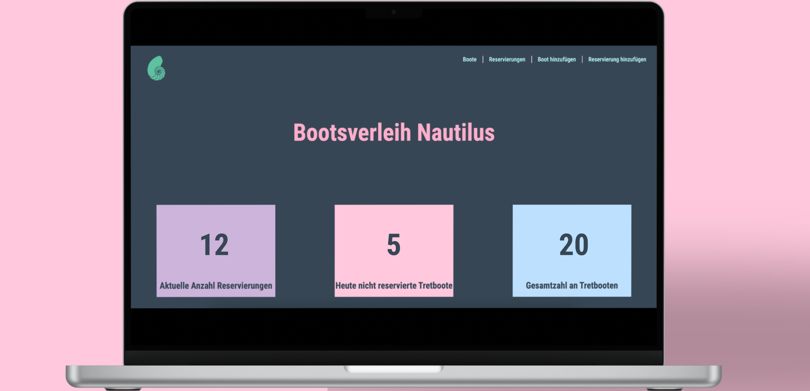

# Fullstack Projekt Bootsverleih
Willkommen zum Nautilus Bootsverleih Projekt! Diese Webanwendung ermöglicht es Benutzer*innen, Bootsausflüge einfach zu verwalten. Die Plattform bietet eine Vielzahl von Funktionen, die es einfach machen, Reservierungen und Bootsdetails einzusehen.

# Funktionen
- **Aktuelle Reservierungen anzeigen:** Anzahl der aktuell getätigten Reservierungen.
- **Gesamtanzahl der Boote:** Anzahl der Boote, die insgesamt zur Verfügung stehen.
- **Heute nicht reservierte Boote:** Anzahl Boote, die heute nicht reserviert sind.
- **Boote und Reservierungen hinzufügen:** Hinzufügen neuer Boote zur Flotte oder Erstellung neuer Reservierungen.
- **Details zu einem Boot einsehen:** Detaillierte Informationen zu jedem einzelnen Boot.
- **Boote und Reservierungen löschen:** Boote aus der Flotte nehmen oder Reservierungen nach Bedarf stornieren.

# Author
- [@philipkuerzel](https://github.com/philipkuerzel)
- [@JohannaHaer](https://github.com/JohannaHaer)

# Mockups

Startseite

Bootdetails
